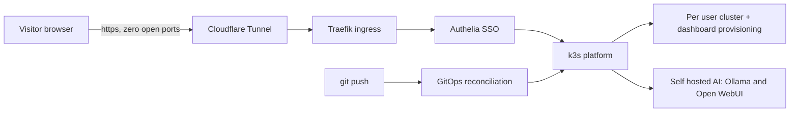

<!--
  GitHub profile README. Lives in the special OllieDixonJr/OllieDixonJr repo,
  so it renders on the profile page at github.com/OllieDixonJr.
-->

# I make Kubernetes security something you can run, not just read about

**Provision a hardened, STIG scanned Kubernetes cluster and dashboard from your browser, right now, at [olliedixonjr.com](https://olliedixonjr.com).** No install, no setup, no waiting.

https://github.com/user-attachments/assets/788efd66-447e-418a-8ab7-310caee91d25

I'm Ollie Dixon, a DevSecOps and Kubernetes Security Specialist at Lockheed Martin. I build and harden Kubernetes platforms, automate the compliance that proves they're secure, and run the whole thing as a live, public demo anyone can sign into.

---

### How the live demo works

A single GitOps driven k3s platform, public through a Cloudflare Tunnel with **zero open ports** to the internet. Sign in through Authelia SSO and it provisions you an isolated cluster and dashboard on demand. The same platform self hosts an AI assistant on local hardware.

---

### Featured project: [KubeSTIG](https://github.com/OllieDixonJr/kubestig)

**Automated DISA Kubernetes STIG scanning that produces CKL output.** A read only Go scanner that evaluates a live Kubernetes cluster against the DISA Kubernetes STIG and emits `.ckl` files, the format STIG Viewer and eMASS consume.

---

### Currently building

- **KubeSTIG:** expanding STIG control coverage and an eMASS friendly export pipeline
- **The public demo:** per user RBAC and stronger isolation for provisioned clusters
- **A write up** of the zero open ports architecture that safely puts a k3s cluster on the public internet

---

### Certifications

---

### Stack

---

### Connect
- [olliedixonjr.com](https://olliedixonjr.com)
- [LinkedIn](https://www.linkedin.com/in/olliedixon)
- OllieDixonJr@gmail.com

Powered by Kubernetes · Deployed via GitOps · Hardened for security.
